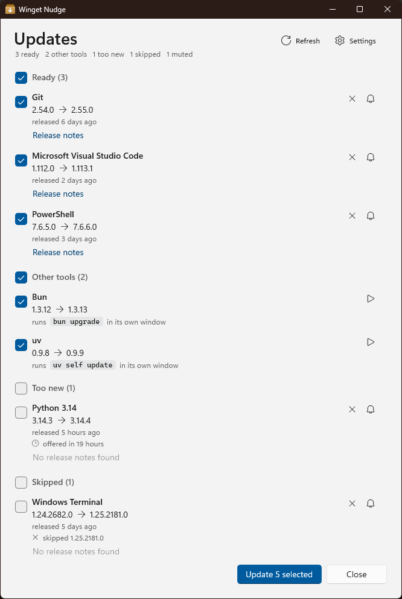

# Winget Nudge

A Windows 11 app that checks winget for package upgrades on a schedule, nudges you with a
notification, and upgrades what you pick in a native progress window.

<picture>
  <source media="(prefers-color-scheme: dark)" srcset="docs/images/picker-dark.png">
  
</picture>

It drives winget through its COM API, so there is no PowerShell module, no terminal window, and no
host that breaks when PowerShell or Windows Terminal upgrade themselves.

## What it does

- A scheduled check runs weekly and after sign-in. When upgrades exist, a notification lists them
  with one button: **Review updates**.
- A quiet check runs every four hours between those. It refreshes release dates and the cooldown, so
  a version that matured overnight is ready when the picker opens. It stays silent unless **Notify
  me as soon as an update appears** is on, and then it announces each new version once.
- The picker lists every upgrade with its versions, how long the new version has been public, and a
  link to its release notes. Sections separate what is ready, tools installed outside winget, and
  what is too new, skipped, muted, or failed last time. Each section's header has a checkbox that
  selects or clears its rows.
- **Too new** counts from when the version landed in `microsoft/winget-pkgs`, not from when this
  machine first saw it. The default wait is 24 hours, so a version published earlier in the week is
  offered right away.
- Per package, you can mute it, or skip just this version until the next one appears.
- **Update selected** opens one elevated window that upgrades the packages in order. Each upgrade
  runs silently first. Only when winget reports a locked file does it find the apps holding it
  through the Restart Manager and ask before closing them. It then retries silently, interactively,
  with force, and without elevation for installers that refuse it, and restarts the apps it closed.
- Tools installed outside winget, such as bun or uv, can be registered with a version command and a
  JSON endpoint. The picker lists them beside the packages. **Update selected** runs each checked
  tool's upgrade command as you, in a PowerShell window of its own, and a row's play button runs
  that one tool straight away.

## Install

Download `WingetNudge-<version>-x64.msi` from the
[latest release](https://github.com/zachthedev/winget-nudge/releases/latest) and run it.
[docs/install.md](docs/install.md) has the requirements, how to check the download, and what an
upgrade and an uninstall do.

## Documentation

| File                               | Holds                                                                |
| ---------------------------------- | -------------------------------------------------------------------- |
| [docs/install.md](docs/install.md) | Requirements, installing, checking the download, upgrade, uninstall  |
| [docs/usage.md](docs/usage.md)     | The command line, settings and data, what the app contacts           |
| [CONTRIBUTING.md](CONTRIBUTING.md) | The gate, commits, tests, dependencies, releases, what never happens |
| [docs/dev.md](docs/dev.md)         | Prerequisites, the first run, running the app, the MSI and signing   |
| [SECURITY.md](SECURITY.md)         | What counts as a vulnerability, and how to report one                |

## Contributing

[CONTRIBUTING.md](CONTRIBUTING.md) has the rules, `dotnet cake.cs` is the gate every change passes
before it leaves the machine, and [docs/dev.md](docs/dev.md) takes a fresh clone to a running app.
Report security problems privately, as [SECURITY.md](SECURITY.md) describes.

Winget Nudge is not affiliated with or endorsed by Microsoft.

## License

[MIT](LICENSE)
